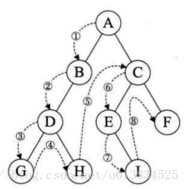

# 数据结构

## 1. 链表

### 1.1. 题目

#### 1.1.1. [合并k个有序链表](https://www.nowcoder.com/practice/65cfde9e5b9b4cf2b6bafa5f3ef33fa6?tpId=295&tqId=724&ru=/exam/oj&qru=/ta/format-top101/question-ranking&sourceUrl=%2Fexam%2Foj)

可用堆解决。根据链表第一个元素的大小把链表放入堆中。取出堆最上面的链表，新链表连接heap最上面链表的首个node。最上面链表去除掉第一个元素后，把链表重新放入堆中。

#### 1.1.2. [链表找环](https://www.nowcoder.com/practice/650474f313294468a4ded3ce0f7898b9?tpId=295&tqId=605&ru=/exam/oj&qru=/ta/format-top101/question-ranking&sourceUrl=%2Fexam%2Foj)

快慢指针，相遇则有环

#### 1.1.3.  [链表中环的入口结点](https://www.nowcoder.com/practice/253d2c59ec3e4bc68da16833f79a38e4?tpId=295&tqId=23449&ru=/exam/oj&qru=/ta/format-top101/question-ranking&sourceUrl=%2Fexam%2Foj) 

快慢指针相遇后，快指针移到链表起点。两个指针同时一步一步走，再次相遇处为环的起点。（可用数学证明）

#### 1.1.4.  [两个链表的第一个公共结点](https://www.nowcoder.com/practice/6ab1d9a29e88450685099d45c9e31e46?tpId=295&tqId=23257&ru=/exam/oj&qru=/ta/format-top101/question-ranking&sourceUrl=%2Fexam%2Foj) 

两个指针从两个链表同时出发。任何链表到达底部之后就移到起点。首次相遇节点即为第一个公共节点。

#### 1.1.5.  [判断一个链表是否为回文结构](https://www.nowcoder.com/practice/3fed228444e740c8be66232ce8b87c2f?tpId=295&tqId=1008769&ru=/exam/oj&qru=/ta/format-top101/question-ranking&sourceUrl=%2Fexam%2Foj) 

可把后半段链表反转，然后从前半段链表起点和反转后的后半段链表起点一起读。

### 1.2. 注意事项

注意节点的next是否需要设置为nullptr；

注意最后一个节点是否正确；

## 2. 二分查找与排序

### 2.1. 题目

#### 2.1.1  [有序二维数组中的查找](https://www.nowcoder.com/practice/abc3fe2ce8e146608e868a70efebf62e?tpId=295&tqId=23256&ru=/exam/oj&qru=/ta/format-top101/question-ranking&sourceUrl=%2Fexam%2Foj) 

空间复杂度*O*(1) ，时间复杂度*O*(*n*+*m*) 。

从二维数组的**左下角**开始。数的上方数字一定比他小；右边一定比他大。查找对象若比这个数字大，则右移；若查找对象比他小，则上移。

#### 2.1.2.  [寻找峰值](https://www.nowcoder.com/practice/fcf87540c4f347bcb4cf720b5b350c76?tpId=295&tqId=2227748&ru=/exam/oj&qru=/ta/format-top101/question-ranking&sourceUrl=%2Fexam%2Foj) 

vec[-1] = -$\infty$, vec[size] = -$\infty$ 

从中间出发。若vec[mid]小于左边的值，则左边必有山峰；若小于右边的值，则右边必有山峰。小于左边，则把寻找区间改为最左边到中间；......

#### 2.1.3.  [数组中的逆序对](https://www.nowcoder.com/practice/96bd6684e04a44eb80e6a68efc0ec6c5?tpId=295&tqId=23260&ru=/exam/oj&qru=/ta/format-top101/question-ranking&sourceUrl=%2Fexam%2Foj) 

将一个数组拆成两个子数组。第一个子数组无论如何排序，第一个数组中的数在第二个数组中产生的逆序对都不会改变。故而可以利用这一性质二分递归。

利用类似归并排序的方法。f(left, right) = f(left,mid) + f(mid, right) + #左边子数组相对于右边子数组的逆序对

#### 2.1.4.  [旋转数组的最小数字](https://www.nowcoder.com/practice/9f3231a991af4f55b95579b44b7a01ba?tpId=295&tqId=23269&ru=/exam/oj&qru=/ta/format-top101/question-ranking&sourceUrl=%2Fexam%2Foj) 

中间的数和最右边的数做对比：若中间的数大，则最小数必在中间*+1*到右边；若中间的数小，最小数在左边到中间；若相等，最右边坐标向左移一格。

### 2.2. 注意事项

注意left=mid+1的情况（mid+1）

## 3. 堆

### 3.1. 定义

完全二叉树。大根堆/小根堆

可将堆存为数组，根据index找父节点、子节点

### 3.2. 建堆

上滤：底部插入；下滤：根部插入。

上滤建堆：添加新元素进堆。

下滤建堆：整个建堆。

### 3.3. 优先队列

#### 3.3.1. 弹出最小元素

用小根堆，弹出顶部节点，将最后一个元素放入根节点，下滤

#### 3.3.2. 堆排序

优先队列依次输出

## 4. 二叉树

### 4.1. 前序中序后序遍历

## 5. 排序

1. **冒泡排序 (Bubble Sort)**
   - **描述**：通过重复地遍历列表，比较每对相邻的元素并交换它们（如果它们的顺序错误）。
   - **时间复杂度**：最好情况 O(n)，平均和最坏情况 O(n^2)。
   - **空间复杂度**：O(1)。
   - **稳定性**：稳定。
2. **选择排序 (Selection Sort)**
   - **描述**：在未排序的部分中找到最小（或最大）的元素，然后将其放到已排序部分的末尾。
   - **时间复杂度**：始终为 O(n^2)。
   - **空间复杂度**：O(1)。
   - **稳定性**：不稳定。
3. **插入排序 (Insertion Sort)**
   - **描述**：构建有序序列，对于未排序的元素，在已排序的序列中从后向前扫描，找到相应的位置并插入。
   - **时间复杂度**：最好情况 O(n)，平均和最坏情况 O(n^2)。
   - **空间复杂度**：O(1)。
   - **稳定性**：稳定。
4. **快速排序 (Quick Sort)**
   - **描述**：选择一个“基准”元素，将列表分为两部分：小于基准的元素和大于基准的元素。然后递归地对这两部分进行排序。
   - **时间复杂度**：平均情况 O(n log n)，最坏情况 O(n^2)。
   - **空间复杂度**：O(log n)（递归调用的深度）。
   - **稳定性**：不稳定。
5. **归并排序 (Merge Sort)**
   - **描述**：将列表分成两半，递归地对它们进行排序，然后将两个已排序的半部分合并成一个整体。
   - **时间复杂度**：始终为 O(n log n)。
   - **空间复杂度**：O(n)。
   - **稳定性**：稳定。
6. **堆排序 (Heap Sort)**
   - **描述**：利用堆这种数据结构所设计的一种排序算法。堆积是一个近似完全二叉树的结构，并同时满足堆积的性质。
   - **时间复杂度**：始终为 O(n log n)。
   - **空间复杂度**：O(1)。
   - **稳定性**：不稳定。
7. **希尔排序 (Shell Sort)**
   - **描述**：基于插入排序的一种算法，其中插入排序的操作有间隔序列。
   - **时间复杂度**：取决于间隔序列，最坏情况为 O(n^2)。
   - **空间复杂度**：O(1)。
   - **稳定性**：不稳定。

