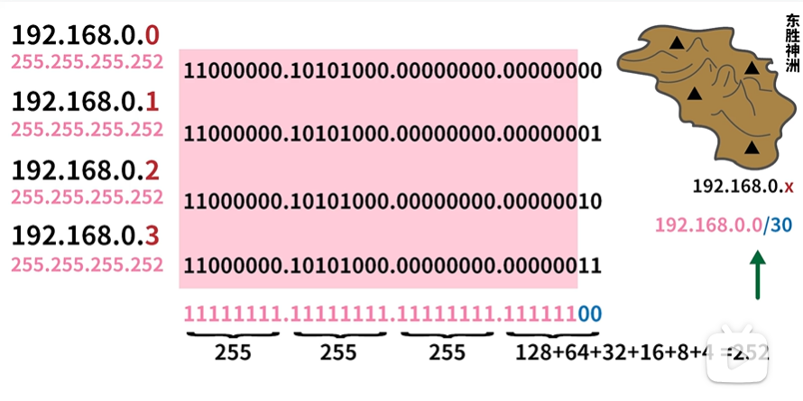
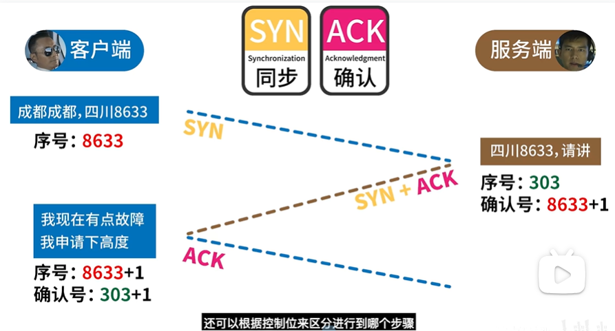
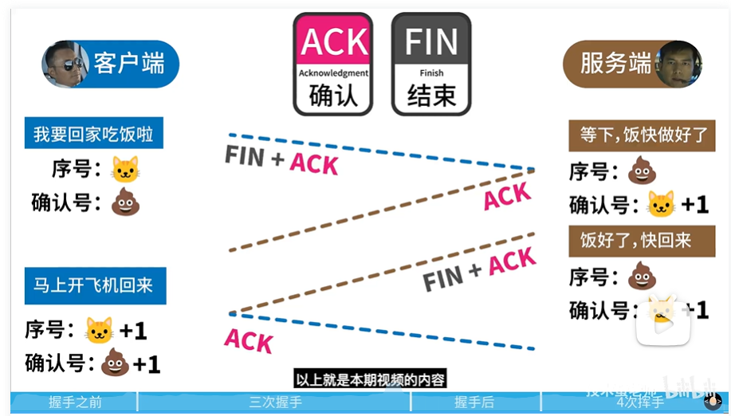
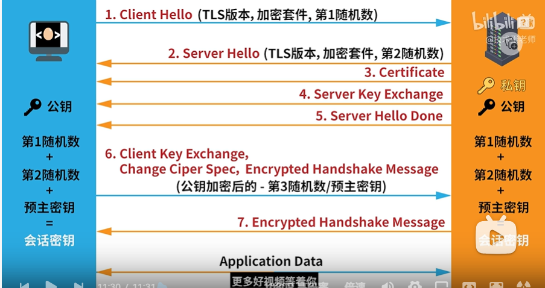

# Network

## 1. OSI & TCP/IP 模型

#### 1.1. __7个层必背__！！！

会话层：同步服务、管理连接状态（用户名密码）；表示层：解码编码；传输层（socket，TCP/UDP)


1.2. 各层数据、地址


## 2. IP 协议

#### 2.1. IPv4 子网掩码

IP地址=网络号+主机号

子网掩码：用以区分网络号和主机号的边界。

例子：



子网掩码：255.255.255.252.       

上图的30是CIDR写法，表示前30位是网络号，后两位是主机号。

（CIDR（Classless Inter-Domain Routing，无类域间路由选择）它消除了传统的A类、B类和C类地址以及划分子网的概念，因而可以更加有效地分配IPv4的地址空间）。

#### 2.2. IPv6

128位。（IPv4：32位）。


## 3. TCP协议

#### 3.1. 三次握手



为什么要三次握手？

__一次不行__：不能确定对方是否可以收到信息。

__两次不行__：不能避免历史连接。倘若有失效的链接，未经过客户端确认（第三次握手）就发送相关信息可能导致发的信息是错误的。

#### 3.2. 四次挥手



**第一次挥手**：客户端想关闭通信，告诉服务端，我不想和你通信了。 

**第二次挥手**：但服务端可能还有数据 发给客户端的没有传完。因此先给一个确认。在这之后客户端不需要再发送一次挥手了，可以节省资源。

**第三次挥手**：等服务器端传输完毕，再告诉客户端我们结束吧。

**第四次挥手**：客户端收到 服务器的结束通信的信息，给服务器一个确认。


## 4. HTTP协议

#### 4.1. HTTPS

##### 4.1.1. HTTPS = HTTP + SSL/TLS

##### 4.1.2. TLS握手




1. 注意server hello done
2. **预主密钥**通过**非对称加密**（如RSA）生成。用户端生成预主密钥后用服务器公钥加密后发送给服务器，服务器用自己的私钥解密得到预主密钥。
3. 用户端和客户端各自通过第一随机数、第二随机数、预主密钥生成**会话密钥**。会话密钥**不需要传输**。
4. **非对称加密（如RSA）生成预主密钥，确保安全性；对称加密（如AES）用于会话加密，确保高效率**。


#### 4.2. 状态码

HTTP状态码（HTTP Status Codes）是由三位数字组成的，用于表示Web服务器处理HTTP请求的结果。以下是一些常见的HTTP状态码及其描述：

#### 1xx - 信息响应（Informational responses）

- **100 Continue**：请求的初始部分已被服务器接收，客户端应继续发送请求的其余部分。
- **101 Switching Protocols**：服务器已理解客户端的请求，并将通过Upgrade消息头通知客户端切换协议。

#### 2xx - 成功响应（Successful responses）

- **200 OK**：请求成功。根据请求的方法，可能会返回结果或无内容。
- **201 Created**：请求已成功，并因此创建了一个新的资源。
- **202 Accepted**：请求已被接受，但尚未处理。
- **204 No Content**：请求成功，但没有要返回的内容。

#### 3xx - 重定向响应（Redirection messages）

- **300 Multiple Choices**：有多种选择。用户或浏览器可以选择一个来进行访问。
- **301 Moved Permanently**：请求的URL已永久移动到另一个位置。
- **302 Found**：请求的资源现在临时从不同的URI响应。
- **304 Not Modified**：资源自上次请求后没有发生变化，通常用于缓存。

#### 4xx - 客户端错误响应（Client error responses）

- **400 Bad Request**：请求无效或语法错误。
- **401 Unauthorized**：请求需要用户验证。
- **403 Forbidden**：服务器理解请求，但拒绝执行。
- **404 Not Found**：服务器找不到请求的资源。
- **405 Method Not Allowed**：请求方法不被允许。
- **429 Too Many Requests**：用户在给定的时间内发送了太多的请求。

#### 5xx - 服务器错误响应（Server error responses）

- **500 Internal Server Error**：服务器遇到错误，无法完成请求。
- **501 Not Implemented**：服务器不支持请求中所用的方法。
- **502 Bad Gateway**：服务器作为网关或代理，从上游服务器收到无效响应。
- **503 Service Unavailable**：服务器目前无法使用（由于超载或停机维护）。
- **504 Gateway Timeout**：服务器作为网关或代理，但是没有及时从上游服务器收到请求。

这只是HTTP状态码的一部分，还有许多其他状态码用于特定的情况。


### 4.3. HTTP版本

#### HTTP/1.1

1. **文本协议**：HTTP/1.1是基于文本的，这使得它易于读取和调试。
2. **连接管理**：每个HTTP请求都需要一个新的TCP连接，这导致了所谓的"头部阻塞"问题，即一个请求的延迟会影响其他请求。
3. **长连接**：引入了`keep-alive`头，允许在一个TCP连接上进行多个请求和响应交换，以减少建立和关闭连接的开销。
4. **管道化**：允许在一个连接上发送多个请求，但响应仍然需要按照请求的顺序返回，这仍然存在头部阻塞的问题。

#### HTTP/2

1. **二进制协议**：HTTP/2是基于二进制的，这使得它更加高效和精确。
2. **多路复用**：在一个单一的TCP连接上，可以同时处理多个请求和响应，从而消除了头部阻塞的问题。
3. **头部压缩**：使用HPACK压缩算法来减少头部数据的大小，从而提高性能。
4. **服务器推送**：服务器可以“推送”资源到客户端，即在客户端请求之前就发送资源。
5. **优先级和依赖性**：请求可以有优先级，允许更重要的请求更快地被处理。

#### HTTP/3

1. **基于QUIC**：HTTP/3不再使用TCP，而是使用QUIC（一个基于UDP的多路复用和零往返时间的传输协议）。这提供了更好的性能，特别是在丢包和网络不稳定的环境中。
2. **内置安全性**：QUIC包括TLS 1.3，这意味着加密和安全性是内置的，不需要额外的握手步骤。
3. **更好的连接迁移**：由于基于UDP，当用户的IP地址变化时（例如从Wi-Fi切换到移动数据），连接可以更容易地迁移。
4. **没有头部阻塞**：即使在丢包的情况下，由于QUIC的多路复用特性，单个丢失的数据包不会阻塞其他独立的数据流。

## 5. Cookie, Token, Session, LocalStorage

#### 5.1. Intuition

HTTP无状态，如何保持用户登陆状态？答：每次发送请求都带上身份验证信息。于是有了cookie

#### 5.2. Cookie

数据的载体（相当于车），cookie加请求一起发送给服务器。

早期的rest请求直接把账密放到cookie里。

Cookie在客户端发送相关请求之后在服务端中生成，然后发给客户端。

#### 5.3. Session ID和Token

##### 5.3.1. Session

SessionID产生于服务器，发送给浏览器，由服务器存储。Session由**服务器主导**。

优点：相比于直接发送账密提供了一定的安全性，sessionID泄露影响不大。

缺点：增加服务器负载。服务器需要自行存储、删除、维护sessionID，且在分布式系统中还需要多服务器同步sessionID。

##### 5.3.2. Token

Token产生于服务器，发送给浏览器。Token由**浏览器主导**。浏览器存储Token，但无法解密token。

优点：服务器不必储存Token。解决了分布式系统的同步问题。

#### 5.4. Storage

##### 5.4.1. Storage VS Cookie

Storage大，不参与通信（不被发送到服务器），有效期无限或到窗口关闭。

Cookie小，参与通信（会被发送到服务器），有效期自行设置。

##### 5.4.2. Local Storage VS Session Storage

1. 有效期不同。local storage永久有效，session storage关闭窗口后失效。

2. 访问不同窗口的权限不同。 `sessionStorage` 在不同的窗口或标签页之间是独立的； `localStorage` 在同一个浏览器的所有窗口和标签页之间是共享的（只要它们**同源**） 。

   "同源" 指的是相同的协议、域名和端口。 

## 6. 正向代理与反向代理

### 1. 正向代理 (Forward Proxy)：

### 定义：

正向代理位于客户端和目标服务器之间，为客户端代理请求到互联网上的资源。

### 主要用途：

- **内容过滤**：例如，学校或公司可能使用正向代理来阻止用户访问特定的网站。
- **访问受限资源**：例如，使用 VPN 或代理服务器访问地理限制的内容。
- **缓存**：减少重复的外部请求，从而提高速度和减少带宽使用。
- **隐私和匿名浏览**：隐藏用户的真实 IP 地址。

### **例子**：

你在中国，想看美国的Netflix，但Netflix有地区限制。你可以使用一个位于美国的正向代理，这样Netflix会认为请求是从美国发出的。 

### 工作方式：

客户端配置其网络设置以使用正向代理。当客户端尝试访问一个 URL 或资源时，请求首先发送到正向代理。代理评估请求，然后决定如何处理它（例如，允许、拒绝或从缓存中提供内容）。

### 2. 反向代理 (Reverse Proxy)：

### 定义：

反向代理接收来自互联网的请求，并将它们转发到后端服务器。它代表后端服务器与互联网进行交互。

### 主要用途：

- **负载均衡**：将来自客户端的请求分发到多个后端服务器，从而分散负载。
- **SSL 终止**：反向代理可以处理 SSL/TLS 握手，从而减轻后端服务器的负担。
- **缓存**：存储后端服务器的响应，从而加快速度和减少后端服务器的负载。
- **压缩**：减少传输到客户端的数据量。
- **安全和匿名性**：隐藏后端服务器的真实 IP 地址和结构。

### **例子**：

 一个大型网站可能有多台服务器提供内容，但用户不知道这一点。当用户访问该网站时，反向代理决定将用户的请求发送到哪台服务器，并将服务器的响应返回给用户。 

### 工作方式：

当从互联网上的客户端发出请求时，这些请求首先到达反向代理。代理决定将请求转发到哪个后端服务器，并可能在转发之前或之后对请求或响应进行处理。

## 总结：

- **正向代理**代表**客户端**与互联网进行交互。
- **反向代理**代表**后端服务器**与互联网进行交互。

XSS（Cross-Site Scripting）攻击是利用网站没有对用户输入进行适当验证和转义的漏洞，将恶意脚本注入到其他用户的浏览器中执行。以下是对XSS的更详细的解释，以及一些具体的例子：

## 7. XSS跨站脚本攻击

 XSS（Cross-Site Scripting）攻击是利用网站没有对用户输入进行适当验证和转义的漏洞，将恶意脚本注入到其他用户的浏览器中执行。以下是对XSS的更详细的解释，以及一些具体的例子： 

### 1. 反射型XSS

**描述**： 攻击者构造一个包含恶意脚本的 URL，这个脚本作为请求的一部分（通常是**查询字符串？**）发送给**服务器**。  服务器接收到这个请求，处理其中的数据，并将其作为响应的一部分返回。如果服务器没有正确地清理或转义这些数据，恶意脚本就会包含在响应中。

**例子**： 假设一个搜索引擎的URL结构是这样的：`http://example.com/search?q=keyword` 如果搜索引擎直接将`q`参数的值插入到HTML中，那么攻击者可以创建以下URL： `http://example.com/search?q=alert('Hacked!');` 当受害者点击这个链接时，JavaScript代码会在其浏览器中执行，弹出一个“Hacked!”的警告框。

### 2. 存储型XSS

**描述**：攻击者在网站上（如评论、帖子等）提交恶意脚本，该脚本被存储在服务器上。当其他用户访问这部分内容时，脚本会在他们的浏览器中执行。

**例子**： 假设一个博客允许用户在评论中使用HTML。攻击者可以提交以下评论： `alert('Hacked!');` 当其他用户查看这条评论时，他们的浏览器会执行这段脚本，弹出一个“Hacked!”的警告框。

### 3. DOM型XSS

**描述**： 攻击者构造一个 URL，其中包含恶意脚本，但这个脚本**不会发送给服务器**。 攻击者通过修改DOM结构来执行恶意脚本，而不是直接注入到HTML中。

**例子**： 假设一个网页使用JavaScript从URL的`#`（**哈希值/锚点，不会发给服务器**）部分获取内容，并直接插入到页面中：

```javascript
document.getElementById('content').innerHTML = location.hash.slice(1);
```

攻击者可以创建以下URL： `http://example.com/page#` 当受害者访问这个链接时，恶意的标签会尝试加载一个不存在的图片，触发`onerror`事件，从而执行`alert('Hacked!');`脚本。

### 防御措施：

1. **验证输入**：始终验证用户输入，确保它符合预期的格式。
2. **转义输出**：在将用户输入的数据插入到HTML、JavaScript或其他上下文之前，使用适当的转义函数。
3. **使用内容安全策略（CSP）**：这是一个浏览器功能，可以限制页面上可以执行的脚本。
4. **避免使用`innerHTML`**：使用`textContent`或安全的库，如DOMPurify。
5. **更新和维护**：确保使用的所有软件、库和插件都是最新的，并及时修复已知的安全漏洞。
