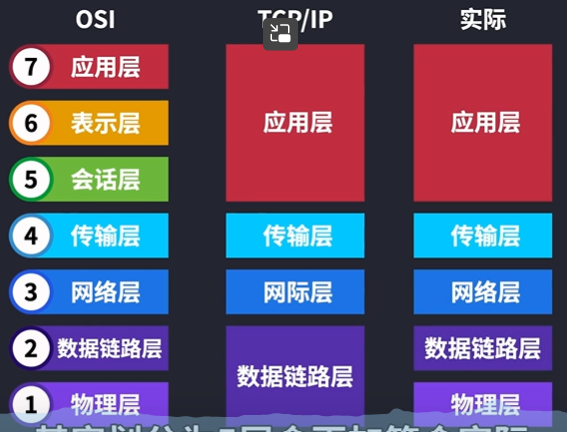

# Network

## 1. OSI & TCP/IP 模型

#### 1.1. __7个层必背__！！！

会话层：同步服务、管理连接状态（用户名密码）；表示层：解码编码；传输层（socket，TCP/UDP)

1.2. 各层数据、地址

## 2. IP 协议

#### 2.1. IPv4 子网掩码

IP地址=网络号+主机号

子网掩码：用以区分网络号和主机号的边界。

例子：

子网掩码：255.255.255.252.       

上图的30是CIDR写法，表示前30位是网络号，后两位是主机号。

（CIDR（Classless Inter-Domain Routing，无类域间路由选择）它消除了传统的A类、B类和C类地址以及划分子网的概念，因而可以更加有效地分配IPv4的地址空间）。

#### 2.2. IPv6

128位。（IPv4：32位）。

## 3. TCP协议

#### 3.1. 三次握手

为什么要三次握手？

__一次不行__：不能确定对方是否可以收到信息。

__两次不行__：不能避免历史连接。倘若有失效的链接，未经过客户端确认（第三次握手）就发送相关信息可能导致发的信息是错误的。

#### 3.2. 四次挥手

**第一次握手**：客户端想关闭通信，告诉服务端，我不想和你通信了。 

**第二次握手**：但服务端可能还有数据 发给客户端的没有传完。因此先给一个确认。在这之后客户端不需要再发送第一次握手了，可以节省资源。

**第三次握手**：等服务器端传输完毕，再告诉客户端我们结束吧。

**第四次握手**：客户端收到 服务器的结束通信的信息，给服务器一个确认。

## 4. HTTP协议

#### 4.1. HTTPS

##### 4.1.1. HTTPS = HTTP + SSL/TLS

##### 4.1.2. TLS握手

1. 注意server hello done
2. **预主密钥**通过**非对称加密**（如RSA）生成。用户端生成预主密钥后用服务器公钥加密后发送给服务器，服务器用自己的私钥解密得到预主密钥。
3. 用户端和客户端各自通过第一随机数、第二随机数、预主密钥生成**会话密钥**。会话密钥**不需要传输**。
4. **非对称加密（如RSA）生成会话密钥，确保安全性；对称加密（如AES）用于会话加密，确保高效率**。

