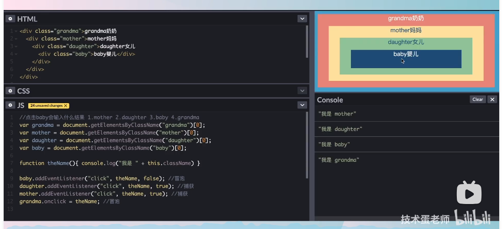

# 前端编程

## 1. [事件捕获与冒泡](https://www.bilibili.com/video/BV1m7411L7YW/?spm_id_from=333.788&vd_source=a82ddca015c3600e3ebfadd0eb69d716)

#### 1. DOM事件流

事件捕获阶段（自上而下）+处于目标阶段+事件冒泡阶段（自下而上）

#### 2. 例子



事件捕获优先于事件冒泡。事件捕获从上到下，所以先触发mother再触发daughter。然后再事件冒泡自下而上，先baby再grandma。


## 2. 防抖（debounce）

**原理**：如果在一个时间段内连续触发同一个事件，只执行最后一次。

**常见应用场景**：搜索框实时搜索、窗口大小调整。

**示例**：

想象一个搜索框，用户在输入时，你希望能够实时显示搜索结果。但如果每次用户输入一个字符时都发送一个请求到服务器，服务器可能会被大量的请求淹没。使用防抖，只有当用户停止输入一段时间（例如300毫秒）后，才会发送一个请求。

```javascript
function debounce(func, delay) {
    let timeout;
    return function() {
        const context = this;
        const args = arguments;
        clearTimeout(timeout);
        timeout = setTimeout(function() {
            func.apply(context, args);
        }, delay);
    };
}

const searchInput = document.getElementById('searchInput');

searchInput.addEventListener('input', debounce(function() {
    console.log('Sending request for:', searchInput.value);
}, 300));
```

**难点0：流程**

clearTimeout，再setTimeout。例子：设置一个按钮，点击后会100ms后触发事件。第一次点击，设置100ms后触发。99ms后第二次点击，重新计时，事件再过100ms后触发

**难点1：回调函数的正确传入方式**

不可以直接searchInput.addEventListener('input', debounce(func)).直接这样写会在绑定时就执行debounce(func)。正确处理办法是debounce(func) return一个匿名或者箭头函数。

**难点2：闭包**

不用闭包的话每次会生成一个新的timeout，不能实现防抖效果。

**难点3：重新绑定**

非构造非方法非匿名非箭头的函数的this值默认为global/window，这可能导致一些问题。用apply显示的修改this值。

## 3.节流 (Throttle)

**原理**：在一个时间段内，不管事件触发多少次，只执行一次。

**常见应用场景**：滚动事件监听、持续的鼠标移动。

**示例**：

假设你有一个网页，当用户滚动到页面底部时，你希望加载更多的内容。用户在滚动页面时，滚动事件会非常频繁地触发。使用节流，即使用户连续滚动，你也只每隔一段时间（例如200毫秒）检查一次。

```javascript
function throttle(func, delay) {
    let lastTime = 0;
    return function() {
        const now = Date.now();
        if (now - lastTime > delay) {
            lastTime = now;
            func.apply(this, arguments);
        }
    };
}

window.addEventListener('scroll', throttle(function() {
    if (window.innerHeight + window.scrollY >= document.body.offsetHeight) {
        console.log('Load more content');
    }
}, 200));
```

## 4. 浏览器缓存

#### 1. 强缓存

- **Expires**：这是HTTP/1.0的属性，它指定了一个绝对的过期时间。例如：`Expires: Wed, 21 Oct 2020 07:28:00 GMT`。
- **Cache-Control**：这是HTTP/1.1的属性，它提供了更多的缓存控制选项。例如：
  - `max-age=3600`：资源会在3600秒后过期。
  - `public`：资源可以被所有用户缓存，包括在中间代理服务器中。
  - `private`：资源只能被浏览器缓存。
  - `no-cache`：需要向服务器验证资源的有效性。
  - `no-store`：不缓存资源。

#### 2. 协商缓存

当强缓存失效或不适用时，浏览器会尝试使用协商缓存。这涉及到与服务器的通信，以确定资源是否已更改。

- **Last-Modified / If-Modified-Since**：服务器通过`Last-Modified`标头提供资源的最后修改日期。在后续的请求中，浏览器使用`If-Modified-Since`标头提供此日期，如果资源未更改，服务器会返回`304 Not Modified`状态码。
- **ETag / If-None-Match**：`ETag`是资源的特定版本的标识符（如哈希）。如果资源更改，`ETag`也会更改。浏览器在后续的请求中使用`If-None-Match`标头提供此标识符，服务器会比较它，如果资源未更改，返回`304 Not Modified`状态码。

#### 3. **其他缓存机制**:

- **Service Workers**：这是一种在浏览器后台运行的脚本，它可以拦截和缓存网络请求，使得资源可以离线使用。
- **Memory Cache**：浏览器的内存中的短暂缓存，主要用于当前会话。当浏览器关闭或页面刷新时，内存缓存会被清空。
- **Disk Cache**：浏览器在硬盘上的缓存，用于长期存储。即使浏览器关闭或电脑重启，磁盘缓存也会保留。

#### 4. 优化策略：

1. **设置合适的缓存策略**：对于不经常更改的资源（如库、框架、图标等），使用长时间的强缓存。对于可能更改的资源，使用协商缓存。
2. **版本控制**：当资源更改时，更改其URL（例如，通过添加查询参数或更改文件名）以确保浏览器加载新版本。
3. **使用Service Workers**：为应用程序提供离线支持和更细粒度的缓存控制。
4. **优先考虑内存缓存**：对于频繁使用的资源，使其保持在内存缓存中可以提供最快的加载速度。

总的来说，正确地使用浏览器缓存可以显著提高网站的性能，减少服务器的负担，并为用户提供更快的加载速度。

## 5. 网页性能优化

#### 1. Service Worker

Service Worker 是一个在浏览器背景中运行的 JavaScript 脚本，它独立于主线程，因此不会因为页面的计算或渲染任务而被阻塞。这使得 Service Worker 非常适合执行那些不需要用户交互并且希望在后台运行的任务，例如推送通知和背景同步。 

Service Worker 的主要特点：

1. **离线访问**：Service Worker 可以拦截网络请求，从缓存中提供资源，使 web 应用在离线时仍然可用。
2. **背景数据同步**：Service Worker 可以在后台同步数据，即使用户没有打开应用（**应用指网页，不是浏览器**）。
3. **推送通知**：即使 web 应用未打开，Service Worker 也可以接收来自服务器的推送通知，并在用户的设备上显示它们。
4. **网络请求代理**：Service Worker 可以拦截和缓存网络请求，从而提供更快的响应和更可靠的性能。

#### 2. CDN

使用 CDN（内容分发网络）优化静态文件是提高网站性能和可靠性的常见策略。CDN 是一个分布式的服务器网络，设计用于有效地传输网页和其他 Web 内容，如图片、样式表、JavaScript 和视频，给全球的用户。