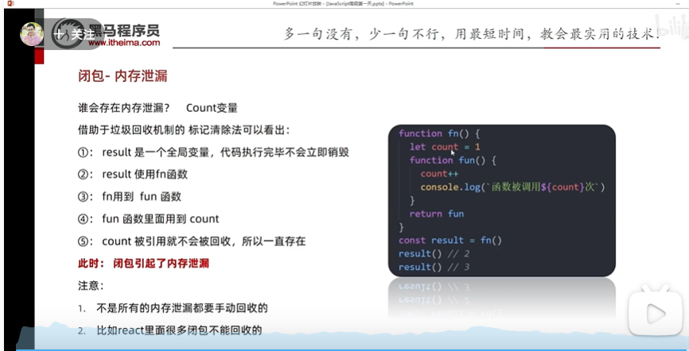

# JavaScript

### 1. === and ==

===: 不做类型转换

==: 做类型转换

eg. 6=="6" (T);

6==="6" (F);

### 2. 函数作用域

1. 作用域链：由里到外，先函数内（局部）再全局

2. 状态提升：函数执行时，函数内的函数名、变量名会先被声明（实际声明顺序不同于代码编写的声明顺序）。

3. **var**和**let**的区别（**4 个区别**！）：

   1. **作用域**：

   **var**：声明的变量具有函数作用域。这意味着在函数内部使用 `var` 声明的变量在整个函数内部都是可见的，无论声明它的位置在哪里。

   **let**：声明的变量具有块作用域。这意味着在花括号 `{}` 内部使用 `let` 声明的变量只在该块内部可见。

   2. **变量提升**：

      **var**：变量会被提升。这意味着可以在声明之前使用变量，但此时变量的值为 `undefined`。

      **let**：变量不会被提升。如果在声明之前尝试使用它，会得到一个引用错误。

   3. **重复声明**：

      - **var**：在同一个作用域内可以多次声明同一个变量。
      - **let**：在同一个作用域内不允许多次声明同一个变量。

   4. **全局对象属性**：

      - **var**：在全局作用域中使用 `var` 声明的变量会成为全局对象（通常是 `window` 对象）的属性。
      - **let**：在全局作用域中使用 `let` 声明的变量不会成为全局对象的属性。

### 3. 原型与原型链

1. `__proto__` and `prototype`

   `__proto__` ued in instance, `prototype` used in constructor functions (which includes classes in JavaScript) .

   ```javascript
   a = new String("abc");
   a.__proto__; // String {'', constructor: ƒ, anchor: ƒ, at: ƒ, big: ƒ, …}
   String.prototype; // String {'', constructor: ƒ, anchor: ƒ, at: ƒ, big: ƒ, …}
   ```

   `实例.__proto__` （隐式原型）==`类.prototype`（显示原型）

2. 隐式原型与显示原型

   隐式原型只存在于对象内。

   显示原型只存在于函数内。

   f.prototype 是一个对象

   class 在原型链中被视为构造函数

3. difference from class in C++/Java

   1. **Inheritance mechanism**: In Javascript, the object can inherit from an instance.
   1. **Flexibility**: In Javascript, you can modify the class/prototype in runtime. In C++, No.

4. 数据类型

   1. 基本数据类型（**5+2**）：

      String, Number, Boolean, Null, Undefined, Symbol (ES6 引入， 用于创建唯一的标识符 ，主要用于创建私有属性), BigInt (ES11 引入，处理大整数)

   2. 引用数据类型：Object. 【Object 是个大类，function 函数、array 数组、date 日期...等都归属于 Object】

   3. 判断类型

   ```javascript
   function getType(value) {
     const type = Object.prototype.toString.call(value);
     // call 改变 Object.prototype.toString 的this。this默认为Object.prototype
     // toString的方法返回的是对象的内部[[Class]]属性。对于自定义的非内置对象，class为Object

     // Extract the type from the returned string, e.g., "[object Type]"
     return type.match(/\[object (\w+)\]/)[1].toLowerCase();
   }

   // 测试
   console.log(getType(123)); // "number"
   console.log(getType("hello")); // "string"
   console.log(getType(true)); // "boolean"
   console.log(getType(undefined)); // "undefined"
   console.log(getType(null)); // "null"
   console.log(getType([])); // "array"
   console.log(getType({})); // "object"
   console.log(getType(function () {})); // "function"
   console.log(getType(/abc/)); // "regexp"
   console.log(getType(new Date())); // "date"
   ```

5. difference from class in C++/Java

   1. **Inheritance mechanism**: In Javascript, the object can inherit from an instance.
   1. **Flexibility**: In Javascript, you can modify the class/prototype in runtime. In C++, No.

6. `xx instanceof XX` is true, if `XX` is on the prototype chain of `xx`. For instance, `array instanceof Array` is true.

   Notice: `xx typeof` **only** returns the type of the data (number, string, boolean, undefined, null, object)

   `typeof` 不精准，比如`typeof array`返回的是 object 而非数组。instanceof 需要提前知道大概属于什么，值可以做验证。`Object.prototype.toString.call()`是最好的选择。

### 4. 异步编程

1. Promise

   ```javascript
   function getAsyncData(data) {
     return new Promise((resolve, reject) => {
       setTimeout(() => {
         if (typeof data === "string") {
           resolve(data.toUpperCase());
         } else {
           reject("输入必须是字符串");
         }
       }, 1000);
     });
   }

   getAsyncData("hello")
     .then((result) => {
       console.log(result); // 输出: "HELLO"
       return getAsyncData("world");
     })
     .then((result) => {
       console.log(result); // 输出: "WORLD"
     })
     .catch((error) => {
       console.log(error);
     });
   ```

   1. `resolve(parameter)`的 paramter 即为`then((parameter)=>{})`中回调函数的 parameter。`reject(parameter)`的 paramter 即为`catch((parameter)=>{})`中回调函数的 parameter。

   2. `Promise`对象中仅`resolve`和`reject`中的一个可以执行。一个执行另一个就不会执行。

   3. 链式调用：若前一个`then`返回一个非`Promise`的值，则该值作为下一个`then`的回调函数的参数。若前一个`then`返回一个`Promise`，则下一个`then`以这个`Promise`为准调用。

   4. Promise 的三个状态： **Pending（未决定）**、 **Fulfilled（履行）** 、 **Rejected（拒绝）**

   5. `Promise` 本身并不是异步的，但它通常与异步操作一起使用。`Promise` 的执行器函数（即传递给 `new Promise` 的函数）是同步执行的。这意味着当你创建一个 `Promise` 时，执行器函数会立即执行。

      异步部分是 `Promise` 的 `.then()`、`.catch()` 和 `.finally()` 方法。这些方法中的回调函数会被放入微任务队列，并在当前执行栈清空后执行。

      看下面的例子：

      ```javascript
      console.log("Start");

      new Promise(function executor(resolve, reject) {
        console.log("Executor");
        resolve();
      }).then(function () {
        console.log("Then");
      });

      console.log("End");
      ```

      输出顺序是：

      ```sql
      Start
      Executor
      End
      Then
      ```

2. setTimeout() 设置一段时间后执行

   ```javascript
   let timerId = setTimeout(() => {
     console.log("This will not be shown");
   }, 2000);

   // later (perhaps after 2000)
   clearTimeout(timerId);
   ```

   缺点：当需要依次进行异步操作时会产生**回调地狱（callback hell）**

   setInterval(()=>{}, 3000); 与 setTimeout 类似，但是重复执行，每隔一段时间执行。

3. fetch('url request').then().then()

   Example:

   ```javascript
   fetch("https://api.example.com/data")
     .then((response) => response.json())
     .then((data) => console.log(data))
     .catch((error) => console.error("Error:", error))
     .finally(); // finally will be executed no matter success or not
   ```

   fetch 会生成一个 Promise。成功则返回 Response 类，失败返回错误对象。

4. Async Await

   Example

   ```javascript
   async function myFunction() {
     let response = await fetch("https://api.example.com/data");
     let data = await response.json(); // execute after the line before finished
     return data;
   }
   ```

   如果想要 async 函数内多条语句并发执行：

   ```javascript
   let promises = await Promise.all([fetch(), fetch()]);
   ```

   调用 async 函数：

   1. 想要获得返回值：func().then(()=>{}).catch(...);
   2. 不需要获得返回值：直接 func(). 这种写法一般在事件处理器中较为常见（onclick）

### 5. 深浅拷贝

#### 1.1 浅拷贝（Shallow Copy）

- **拷贝第一层结构**：浅拷贝会创建一个新的对象或数组，并将原始对象或数组的第一层元素复制到新的对象或数组中。
- **对于原始类型**（如字符串、数字、布尔值），它们的值会被复制。
- **对于引用类型**（如对象、数组），则复制的是引用（内存地址），而不是实际的对象或数组本身。这意味着如果原始对象中的某个属性是另一个对象，浅拷贝后，新对象的这个属性仍然指向同一个对象。

#### 1.2. 浅比较（Shallow Comparison）

- **比较引用**：在进行浅比较时，比较的是两个对象或数组的引用（内存地址），而不是它们的内容。
- **对于原始类型**的值，浅比较会检查它们的值是否相等。
- **对于引用类型**的值，浅比较只检查对象或数组的引用是否相同。即使两个不同的对象或数组包含完全相同的数据，如果它们在内存中的位置不同，浅比较也会认为它们是不相等的。

例子

```javascript
// 浅拷贝示例
let original = { a: 1, b: { c: 2 } };
let shallowCopy = { ...original };

shallowCopy.a = 3; // 不影响 original.a
shallowCopy.b.c = 4; // 影响 original.b.c，因为 b 是引用类型

// 浅比较示例
let obj1 = { a: 1 };
let obj2 = { a: 1 };
let obj3 = obj1;

console.log(obj1 === obj2); // 输出 false，即使内容相同，引用不同
console.log(obj1 === obj3); // 输出 true，引用相同
```

在这个例子中，`shallowCopy` 是 `original` 的浅拷贝，它复制了 `original` 的第一层结构。而 `obj1 === obj2` 的比较结果为 `false`，因为尽管 `obj1` 和 `obj2` 的内容相同，它们是两个不同的对象，存储在不同的内存地址。而 `obj1 === obj3` 的比较结果为 `true`，因为 `obj3` 是 `obj1` 的一个引用。

#### 2.1. 准万能深拷贝方法：

无法处理/拷贝 function、undefined（直接被忽略，好像不存在一样）、原型链等

```javascript
const list = [{ myLove: "sq" }];
const listCopy = JSON.parse(JSON.stringify(list));
```

#### 2.2. 真万能深拷贝方法

##### 2.2.1. 调包

```javascript
const _ = require("lodash");
const clonedObject = _.cloneDeep(originalObject);
```

##### 2.2.2. 手写 deepClone

```javascript
function deepClone(obj) {
  // 1. 判断传入的obj是不是对象，如果不是对象直接返回
  if (typeof obj !== "object" || obj == null) {
    return obj;
  }

  // 2. 初始化返回结果（数组或者对象）
  let result;
  if (obj instanceof Array) {
    result = [];
  } else {
    result = {};
  }

  // 3. 遍历obj所有的key，递归调用deepClone
  for (let key in obj) {
    if (obj.hasOwnProperty(key)) {
      // hasOwnProperty保证key不是原型的属性
      result[key] = deepClone(obj[key]);
    }
  }

  return result;
}
```

### 6. 闭包

闭包=内层函数+引用外层函数的变量+return 内层函数

例子：统计某一函数发动了几次。

意义：保证变量私有。



### 7. 函数柯里化 Curring

柯里化（Currying）是一种在函数式编程中常见的技术，它是将一个接受多个参数的函数转换为一系列使用一个参数的函数的过程。

例如，有一个两个参数的函数 `f(x, y)`，通过柯里化，可以将其转换为一个函数 `g`，`g(x)(y)`。

柯里化的主要用途是：

1. 参数复用：固定一部分参数，生成一个新的函数。
2. 延迟计算：通过柯里化，可以将复杂的计算分解为一系列简单的函数调用。

例子：

```javascript
function curringAdd() {
  let args = [...arguments];
  function fn() {
    args.push(...arguments);
    return fn;
  }
  fn.toString = function () {
    // 注意这里不可以直接写function toString()
    return args.reduce((first, second) => first + second, 0);
  };
  return fn;
}

console.log(curringAdd(1)(2, 3)(4, 5, 6).toString());
```

### 8. JavaScript 导入类

一般 JavaScript 导入方法：

test1.js

```javascript
const exportClass = () => {
  return 2;
};

// export default exportClass;
module.exports = {
  exportClass: exportClass,
};
```

test2.js

```javascript
const { exportClass } = require("./test1.js");
console.log(exportClass()); // 2
```

import xxx; export default xxx; 为 webpack 中使用的方法

### 9. this

This 在不同位置的定义：

#### 1. **全局上下文**

```javascript
console.log(this === window); // 在浏览器中输出：true
```

在全局上下文中（不在任何函数内部），`this`引用的是全局对象。

- 在浏览器中，`this`指向`window`对象。
- 在 Node.js 中，`this`指向`global`对象。

#### 2. **函数调用**

这是因为在传统函数（非箭头函数）中，`this` 关键字通常指向调用该函数的对象。 当一个函数（包括匿名函数）被调用时（而**不是作为方法或构造函数**），`this`通常指向全局对象。

```javascript
function test() {
  console.log(this === window); // 在浏览器中输出：true
}

test();
```

#### 3. **方法调用**

当一个函数作为对象的方法被调用时，`this`指向该对象。

```javascript
const obj = {
  name: "Alice",
  greet: function () {
    console.log("Hello, " + this.name);
  },
};

obj.greet(); // 输出：Hello, Alice
```

#### 4. **构造函数**

当一个函数与`new`关键字一起被调用时，它被视为一个构造函数。在这种情况下，`this`指向新创建的对象。

```javascript
function Person(name) {
  this.name = name;
}

const alice = new Person("Alice");
console.log(alice.name); // 输出：Alice
```

#### 5. **事件处理器**

在事件处理器中，`this`通常指向触发事件的元素。

```javascript
button.addEventListener("click", function () {
  console.log(this === button); // 输出：true
});
```

#### 6. **显式设置`this`**

使用**`call`**、**`apply`**或**`bind`**方法，你可以显式地设置函数调用时的`this`值。

##### 6.1. **`call`**

- **用途**：*调用*一个函数，并为其指定`this`值和参数。
- **语法**：`func.call([thisArg[, arg1, arg2, ...argN]])`

```javascript
function greet(msg) {
  console.log(msg + ", " + this.name);
}

const person = { name: "Alice" };

greet.call(person, "Hello"); // 输出：Hello, Alice
```

##### 6.2. `apply`

- **用途**：*调用*一个函数，并为其指定`this`值和参数数组（注意与`call`不同，这里是参数**数组**）。
- **语法**：`func.apply([thisArg[, argsArray]])`

```javascript
function greet(msg1, msg2) {
  console.log(msg1 + ", " + this.name + msg2);
}

const person = { name: "Bob" };

greet.apply(person, ["Hello", "!"]); // 输出：Hello, Bob!
```

##### 6.3. `bind`

- **用途**：创建一个新的函数(**不直接调用**)，当这个新函数被调用时，它的`this`值是传递给`bind()`的第一个参数，其参数是`bind()`的其他参数和原函数的参数。
- **语法**：`func.bind([thisArg[, arg1, arg2, ...argN]])`

```javascript
function greet(name1, name2) {
  console.log("Hi, " + this.name + " " + name1 + " " + name2);
}

const person = { name: "Charlie" };
const boundGreet = greet.bind(person);

boundGreet("arthur", "siennna"); // 输出：Hi, Charlie arthur siennna
```

#### 7.**箭头函数**

箭头函数不绑定自己的`this`。它们从包围它们的函数（或全局作用域）继承`this`。

```javascript
const obj = {
  name: "Charlie",
  greet: function () {
    setTimeout(() => {
      console.log("Hello, " + this.name);
    }, 1000);
  },
};

obj.greet(); // 1秒后输出：Hello, Charlie
```

### 10. 事件循环机制

#### 1. 宏任务 (Macrotasks)

宏任务是事件循环中的主要任务。每次执行一个宏任务后，事件循环都会检查微任务队列并执行所有的微任务。常见的宏任务包括：

- `setTimeout`
- `setInterval`
- `setImmediate` (Node.js)
- `requestAnimationFrame`
- I/O 操作 (Node.js)
- UI 渲染

#### 2. 微任务 (Microtasks)

微任务是在当前宏任务结束后，下一个宏任务开始前执行的任务。它们的优先级高于宏任务，这意味着如果微任务队列中有任务，它们会在下一个宏任务之前全部执行。常见的微任务包括：

- `Promise` 的 `then` 和 `catch`
- `process.nextTick` (Node.js)
- `MutationObserver`

#### 事件循环的工作流程：

1. 执行初始脚本或函数，这可以看作是第一个宏任务。
2. 执行所有微任务。当微任务队列为空时，继续下一步。
3. 执行下一个宏任务。
4. 重复第 2 和第 3 步。

#### 示例：

考虑以下代码：

```javascript
console.log("Start");

setTimeout(() => {
  console.log("setTimeout");
}, 0);

Promise.resolve().then(() => {
  console.log("Promise");
});

console.log("End");
```

输出顺序是：

1. `Start`
2. `End`
3. `Promise`
4. `setTimeout`

尽管`setTimeout`的延迟是 0 毫秒，但由于它是一个宏任务，而`Promise`的`then`是一个微任务，`Promise`的回调会在`setTimeout`的回调之前执行。

总之，事件循环、微任务和宏任务是 JavaScript 异步编程的核心概念。理解它们之间的关系和工作方式对于编写高效、非阻塞的代码至关重要。

### 11. 箭头函数与匿名函数的区别

1. **`this` 绑定**: 箭头函数不绑定自己的 `this`。它继承了包围它的函数的 `this` 值。传统的匿名函数有自己的 `this` 值。
2. **参数**: 箭头函数不绑定 `arguments` 对象。如果你在箭头函数内部引用 `arguments`，它将采用包围它的函数的 `arguments` 值。传统的匿名函数绑定其自己的 `arguments` 对象。
3. **使用场景**: 由于 `this` 的行为，箭头函数特别适合用作回调函数，特别是在类和方法中。传统的匿名函数在需要自己的 `this` 或 `arguments` 绑定时更为有用。
4. **构造函数**: 箭头函数不能用作构造函数，你不能使用 `new` 关键字与它们一起使用。传统的函数可以。
5. **原型**: 箭头函数没有 `prototype` 属性，而传统的函数有。

### 12. js array

1. **添加元素**:

   - **push()**: 在数组的末尾添加一个或多个元素，并返回新的长度。

     ```javascript
     let fruits = ["apple", "banana"];
     fruits.push("orange"); // fruits: ['apple', 'banana', 'orange']
     ```

   - **unshift()**: 在数组的开头添加一个或多个元素，并返回新的长度。

     ```javascript
     fruits.unshift("grape"); // fruits: ['grape', 'apple', 'banana', 'orange']
     ```

2. **删除元素**:

   - **pop()**: 删除并返回数组的最后一个元素。

     ```js
     let lastFruit = fruits.pop(); // lastFruit: 'orange'
     ```

   - **shift()**: 删除并返回数组的第一个元素。

     ```javascript
     let firstFruit = fruits.shift(); // firstFruit: 'grape'
     ```

3. **查找元素**:

   - **indexOf()**: 返回元素在数组中的第一个索引，如果不存在则返回 -1。

     ```javascript
     let index = fruits.indexOf("banana"); // index: 1
     ```

   - **includes()**: 检查数组是否包含某个元素，返回 true 或 false。

     ```javascript
     let hasApple = fruits.includes("apple"); // hasApple: true
     ```

4. **遍历数组**:

   - forEach()

     : 对数组的每个元素执行指定的函数。

     ```javascript
     fruits.forEach((fruit) => console.log(fruit));
     ```

5. **转换数组**:

   - map()

     : 创建一个新数组，其结果是该数组中的每个元素都调用一个函数后的返回值。

     ```javascript
     let lengths = fruits.map((fruit) => fruit.length); // lengths: [5, 6]
     ```

6. **筛选数组**:

   - filter()

     : 创建一个新数组，包含通过测试的所有元素。

     ```javascript
     let longFruits = fruits.filter((fruit) => fruit.length > 5); // longFruits: ['banana']
     ```

7. **排序数组**:

   - **sort()**: 对数组的元素进行排序，返回更改后的原数组。

     ```javascript
     fruits.sort(); // fruits: ['apple', 'banana']
     ```

   - **reverse()**: 颠倒数组中元素的顺序，返回更改后的原数组。

     ```javascript
     fruits.reverse(); // fruits: ['banana', 'apple']
     ```

   - **sort() logic rewrite**

     The comparison function takes two arguments (often referred to as a and b). The function should return:

     - negative value if a should come before b
     - Zero if a and b are equivalent in order
     - A positive value if a should come after b

     ```javascript
     // descending
     let numbers = [3, 1, 4, 1, 5, 9, 2, 6];
     numbers.sort(function (a, b) {
       return b - a;
     });
     ```

8. **连接和分割数组**:

   - **join()**: 将数组的所有元素连接成一个字符串。

     ```javascript
     let fruitString = fruits.join(", "); // fruitString: 'banana, apple'
     ```

   - **slice()**: 返回数组的一个片段。

     ```javascript
     let slicedFruits = fruits.slice(1, 3); // slicedFruits: ['apple']
     ```

   - **splice()**: 更改原数组内容，可以添加、删除或替换元素，返回被删除元素的数组。

     ```javascript
     let fruits = ["apple", "banana", "cherry", "date"];

     // 删除元素
     let removedFruits = fruits.splice(1, 2); // ['banana', 'cherry']

     // 添加元素
     fruits.splice(1, 0, "blueberry", "citrus"); // fruits: ['apple', 'blueberry', 'citrus', 'date']

     // 替换元素
     fruits.splice(1, 2, "blackberry"); // fruits: ['apple', 'blackberry', 'date']
     ```

9. **合并数组**:

   - concat()

     : 合并两个或多个数组，返回新数组。

     ```javascript
     let moreFruits = ["orange", "pineapple"];
     let allFruits = fruits.concat(moreFruits); // allFruits: ['banana', 'grape', 'apple', 'orange', 'pineapple']
     ```

10. **其他**:

- **reduce()**: 对数组中的每个元素执行一个函数，并将其减少为单个值。

  ```javascript
  let sum = [1, 2, 3, 4].reduce(
    (accumulator, currentValue) => accumulator + currentValue,
    0
  ); // sum: 10
  ```

- **some()**: 测试数组中是否有元素满足测试函数。

  ```javascript
  let hasLargeFruit = fruits.some((fruit) => fruit.length > 6); // hasLargeFruit: false
  ```

- **every()**: 测试数组中的所有元素是否都满足测试函数。

  ```javascript
  let allFruitsAreShort = fruits.every((fruit) => fruit.length < 7); // allFruitsAreShort: true
  ```

这只是 JavaScript 数组提供的方法的一部分。数组是 JavaScript 中非常强大和灵活的数据结

### 13. js string

1. **charAt()** - 返回指定位置的字符。

   ```javascript
   let str = "Hello";
   console.log(str.charAt(1)); // "e"
   ```

2. **concat()** - 连接两个或多个字符串。

   ```javascript
   let str1 = "Hello";
   let str2 = " World!";
   console.log(str1.concat(str2)); // "Hello World!"
   ```

3. **includes()** - 检查字符串是否包含指定的子字符串。

   ```javascript
   let str = "Hello World!";
   console.log(str.includes("World")); // true
   ```

4. **indexOf()** - 返回指定子字符串首次出现的位置。

   ```javascript
   let str = "Hello World!";
   console.log(str.indexOf("World")); // 6
   ```

5. **slice()** - 提取字符串的片段并在新的字符串中返回。

   ```javascript
   let str = "Hello World!";
   console.log(str.slice(0, 5)); // "Hello"
   ```

6. **split()** - 使用指定的分隔符字符串将一个 `String` 对象分割成字符串数组。

   ```javascript
   let str = "apple,banana,orange";
   console.log(str.split(",")); // ["apple", "banana", "orange"]
   ```

7. **replace()** - 在字符串中用一些字符替换另一些字符。

   ```JavaScript
   let str = "Hello World!";
   console.log(str.replace("World", "JavaScript")); // "Hello JavaScript!"
   ```

8. **toUpperCase()** - 将字符串转换为大写。

   ```javascript
   let str = "Hello";
   console.log(str.toUpperCase()); // "HELLO"
   ```

9. **toLowerCase()** - 将字符串转换为小写。

   ```javascript
   let str = "HELLO";
   console.log(str.toLowerCase()); // "hello"
   ```

10. **trim()** - 去除字符串两端的空白。

    ```javascript
    let str = "   Hello World!   ";
    console.log(str.trim()); // "Hello World!"
    ```

## 14. Map 和 WeakMap

### Map

- **键的类型**：在 `Map` 中，键可以是任何类型的值，包括对象、原始值（如数字、字符串）、函数等。
- **引用方式**：`Map` 对其键和值保持强引用。这意味着只要 `Map` 存在，它所引用的键和值就不会被垃圾回收器回收。
- 特性：
  - `Map` 保留键值对的插入顺序。
  - 可以通过方法如 `size` 属性轻松获取 `Map` 的大小。
  - 提供了丰富的操作方法，如 `set`、`get`、`has`、`delete` 和 `clear`。
- **用途**：适用于需要键值对映射的场景，尤其是当键不仅仅是字符串时。

### WeakMap

- **键的类型**：在 `WeakMap` 中，键必须是对象，不能是原始值。
- **引用方式**：`WeakMap` 对其键保持弱引用，这意味着如果没有其他引用指向键对象，这些对象可以被垃圾回收。`WeakMap` 的存在不会阻止其键所引用的对象被回收。
- 特性：
  - `WeakMap` 中的键值对不保留插入顺序。
  - 由于其弱引用特性，`WeakMap` 不可枚举，这意味着没有方法可以获取 `WeakMap` 的内容或大小。
  - 提供了有限的方法，如 `get`、`set`、`has` 和 `delete`，但没有 `clear` 方法。
- **用途**：适用于当你需要与对象关联私有数据，但又不想干扰对象的垃圾回收。

### 区别

1. **键的类型**：
   - `Map` 的键可以是任意类型。
   - `WeakMap` 的键必须是对象。
2. **引用方式**：
   - `Map` 对键和值保持强引用。
   - `WeakMap` 对键保持弱引用。
3. **生命周期管理**：
   - `Map` 的存在可能阻止其键和值被垃圾回收。
   - `WeakMap` 的键可以随时被垃圾回收，不影响 `WeakMap` 本身。
4. **可枚举性**：
   - `Map` 是可枚举的，可以使用迭代器遍历。
   - `WeakMap` 不可枚举，没有提供遍历其键或值的方法。

### 示例

```javascript
// Map 示例
let map = new Map();
map.set("key1", "value1");
map.set("key2", "value2");
console.log(map.size); // 2

// WeakMap 示例
let weakmap = new WeakMap();
let obj = {};
weakmap.set(obj, "value");
console.log(weakmap.has(obj)); // true
obj = null; // 移除对对象的引用
// 此时，obj 可能会被垃圾回收，相应的键值对也会从 weakmap 中消失
```

在这些示例中，`Map` 用于存储和操作键值对，而 `WeakMap` 用于创建与对象相关联的数据，而不影响对象的生命周期。

## 15. Object

### 1. Object iteration

#### 1. `for...in` Loop

The `for...in` loop iterates over all enumerable properties of an object, including those inherited through the prototype chain.

```javascript
const object = { a: 1, b: 2, c: 3 };

for (const key in object) {
  if (object.hasOwnProperty(key)) {  // Check to avoid inherited properties
    console.log(key, object[key]);
  }
}
```

#### 2. `Object.keys()`

`Object.keys()` returns an array of an object's own enumerable property names, iterated in the same order that a normal loop would. You can then iterate over these keys using array methods.

```javascript
const object = { a: 1, b: 2, c: 3 };
const keys = Object.keys(object);

keys.forEach((key) => {
  console.log(key, object[key]);
});
```

#### 3. `Object.values()`

If you need the values from the object, you can use `Object.values()` to get an array of values and then iterate over them.

```javascript
const object = { a: 1, b: 2, c: 3 };
const values = Object.values(object);

values.forEach((value) => {
  console.log(value);
});
```

#### 4. `Object.entries()`

`Object.entries()` returns an array of the object's own enumerable string-keyed property `[key, value]` pairs. This is useful if you need both keys and values.

```javascript
const object = { a: 1, b: 2, c: 3 };
const entries = Object.entries(object);

entries.forEach(([key, value]) => {
  console.log(key, value);
});
```

#### 5. Using `for...of` with `Object.entries()`

If you prefer the `for...of` syntax, you can combine it with `Object.entries()`:

```javascript
const object = { a: 1, b: 2, c: 3 };

for (const [key, value] of Object.entries(object)) {
  console.log(key, value);
}
```

Each method serves different needs, so you can choose the one that best fits your situation based on what you need to access from the object (keys, values, or both).

