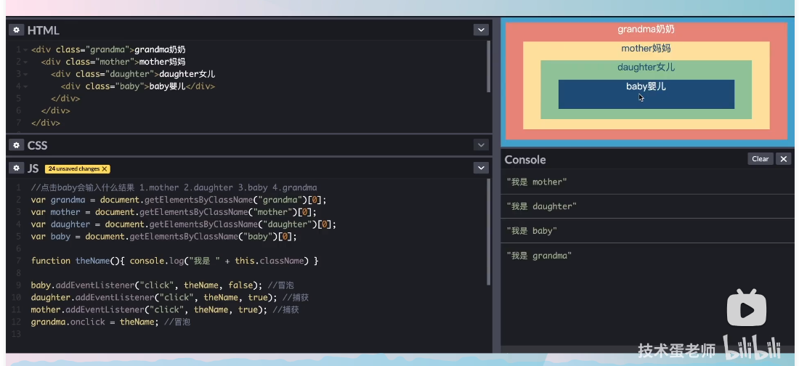

# JavaScript

### 1. === and ==

===: 不做类型转换

==: 做类型转换

eg. 6=="6" (T);  

6==="6" (F);

### 2. 函数作用域

1. 作用域链：由里到外，先函数内（局部）再全局
2. 状态提升：函数执行时，函数内的函数名、变量名会先被声明（实际声明顺序不同于代码编写的声明顺序）。
3. **var**和**let**的区别：

    1. **作用域**：
   - **var**：声明的变量具有函数作用域。这意味着在函数内部使用 `var` 声明的变量在整个函数内部都是可见的，无论声明它的位置在哪里。
       - **let**：声明的变量具有块作用域。这意味着在花括号 `{}` 内部使用 `let` 声明的变量只在该块内部可见。
2. **变量提升**：
       - **var**：变量会被提升。这意味着可以在声明之前使用变量，但此时变量的值为 `undefined`。
       - **let**：变量不会被提升。如果在声明之前尝试使用它，会得到一个引用错误。
    3. **重复声明**：
       - **var**：在同一个作用域内可以多次声明同一个变量。
       - **let**：在同一个作用域内不允许多次声明同一个变量。
    4. **全局对象属性**：
       - **var**：在全局作用域中使用 `var` 声明的变量会成为全局对象（通常是 `window` 对象）的属性。
       - **let**：在全局作用域中使用 `let` 声明的变量不会成为全局对象的属性。

### 3. 原型与原型链

1. `__proto__`  and `prototype`

   `__proto__`  ued in instance, `prototype` used in  constructor functions (which includes classes in JavaScript) .

   ```javascript
   a = new String('abc') 
   a.__proto__ // String {'', constructor: ƒ, anchor: ƒ, at: ƒ, big: ƒ, …}
   String.prototype // String {'', constructor: ƒ, anchor: ƒ, at: ƒ, big: ƒ, …}
   ```

   `实例.__proto__` （隐式原型）==`类.prototype`（显示原型）

2. 隐式原型与显示原型

   隐式原型只存在于对象内。

   显示原型只存在于函数内。

   f.prototype是一个对象

   class在原型链中被视为构造函数

3. difference from class in C++/Java

   1. **Inheritance mechanism**: In Javascript, the object can inherit from an instance. 
   1. __Flexibility__: In Javascript, you can modify the class/prototype in runtime. In C++, No. 

4. 数据类型

   1. 基本数据类型：String, Number, Boolean, Null, Undefined, Symbol (ES6引入), BigInt (ES11引入)
   2. 引用数据类型：Object.  【Object是个大类，function函数、array数组、date日期...等都归属于Object】 
   3. 判断类型

   ```javascript
   function getType(value) {
       const type = Object.prototype.toString.call(value);
       // call 改变 Object.prototype.toString 的this。this默认为Object.prototype
       // toString的方法返回的是对象的内部[[Class]]属性。对于自定义的非内置对象，class为Object
   
       // Extract the type from the returned string, e.g., "[object Type]"
       return type.match(/\[object (\w+)\]/)[1].toLowerCase();
   }
   
   // 测试
   console.log(getType(123));             // "number"
   console.log(getType("hello"));         // "string"
   console.log(getType(true));            // "boolean"
   console.log(getType(undefined));       // "undefined"
   console.log(getType(null));            // "null"
   console.log(getType([]));              // "array"
   console.log(getType({}));              // "object"
   console.log(getType(function() {}));   // "function"
   console.log(getType(/abc/));           // "regexp"
   console.log(getType(new Date()));      // "date"
   ```

   

5. difference from class in C++/Java

   1. **Inheritance mechanism**: In Javascript, the object can inherit from an instance. 
   1. __Flexibility__: In Javascript, you can modify the class/prototype in runtime. In C++, No. 

6. `xx instanceof XX` is true, if `XX` is on the prototype chain of `xx`. For instance, `array instanceof Array` is true.

   Notice: `xx typeof` **only** returns the type of the data (number, string, boolean, undefined, null, object)

### 4. 异步编程

1. Promise

   ```javascript
   function getAsyncData(data) {
       return new Promise((resolve, reject) => {
           setTimeout(() => {
               if (typeof data === 'string') {
                   resolve(data.toUpperCase());
               } else {
                   reject('输入必须是字符串');
               }
           }, 1000);
       });
   }
   
   getAsyncData('hello')
       .then(result => {
           console.log(result); // 输出: "HELLO"
           return getAsyncData('world');
       })
       .then(result => {
           console.log(result); // 输出: "WORLD"
       })
       .catch(error => {
           console.log(error);
       });
   ```

   1. `resolve(parameter)`的paramter即为`then((parameter)=>{})`中回调函数的parameter。`reject(parameter)`的paramter即为`catch((parameter)=>{})`中回调函数的parameter。

   2. `Promise`对象中仅`resolve`和`reject`中的一个可以执行。一个执行另一个就不会执行。

   3. 链式调用：若前一个`then`返回一个非`Promise`的值，则该值作为下一个`then`的回调函数的参数。若前一个`then`返回一个`Promise`，则下一个`then`以这个`Promise`为准调用。

   4. `Promise` 本身并不是异步的，但它通常与异步操作一起使用。`Promise` 的执行器函数（即传递给 `new Promise` 的函数）是同步执行的。这意味着当你创建一个 `Promise` 时，执行器函数会立即执行。

      异步部分是 `Promise` 的 `.then()`、`.catch()` 和 `.finally()` 方法。这些方法中的回调函数会被放入微任务队列，并在当前执行栈清空后执行。

      看下面的例子：

      ```javascript
      console.log('Start');
      
      new Promise(function executor(resolve, reject) {
          console.log('Executor');
          resolve();
      }).then(function() {
          console.log('Then');
      });
      
      console.log('End');
      ```

      输出顺序是：

      ```sql
      codeStart
      Executor
      End
      Then
      ```

2. setTimeout() 设置一段时间后执行

   ```javascript
   let timerId = setTimeout(() => {
     console.log('This will not be shown');
   }, 2000);
   
   // later (perhaps after 2000)
   clearTimeout(timerId);
   ```

   缺点：当需要依次进行异步操作时会产生**回调地狱（callback hell）**

   setInterval(()=>{}, 3000); 与setTimeout类似，但是重复执行，每隔一段时间执行。

3. fetch('url request').then().then()

   Example:

   ```javascript
   fetch('https://api.example.com/data')
     .then(response => response.json())
     .then(data => console.log(data))
     .catch(error => console.error('Error:', error))
     .finally();// finally will be executed no matter success or not
   ```

   fetch会生成一个Promise。成功则返回Response类，失败返回错误对象。

4. Async Await

   Example

   ```javascript
   async function myFunction() {
     let response = await fetch('https://api.example.com/data');
     let data = await response.json(); // execute after the line before finished
     return data;
   }
   ```

   如果想要async函数内多条语句并发执行：

   ```javascript
   let promises = await Promise.all([fetch(), fetch()])
   ```

   调用async函数：

   1. 想要获得返回值：func().then(()=>{}).catch(...);
   2. 不需要获得返回值：直接func(). 这种写法一般在事件处理器中较为常见（onclick）


### 5. 深浅拷贝

#### 1. 准万能深拷贝方法：

无法处理/拷贝function、undefined、原型链等

```javascript
const list=[{myLove:'sq'}];
const listCopy = JSON.parse(JSON.stringify(list))
```

#### 2. 真万能深拷贝方法

##### 2.1. 调包

```javascript
const _ = require('lodash');
const clonedObject = _.cloneDeep(originalObject);
```

##### 2.2. 手写deepClone

```javascript
function deepClone(obj){
    // 1. 判断传入的obj是不是对象，如果不是对象直接返回
    if (typeof obj !== 'object' || obj == null){
        return obj
    }

    // 2. 初始化返回结果（数组或者对象）
    let result;
    if (obj instanceof Array){
        result = []
    }
    else{
        result = {}
    }

    // 3. 遍历obj所有的key，递归调用deepClone
    for (let key in obj){
        if (obj.hasOwnProperty(key)){ // hasOwnProperty保证key不是原型的属性
            result[key] = deepClone(obj[key])
        }
    }

    return result;
}
```


### 6. 闭包

闭包=内层函数+引用外层函数的变量

例子：统计某一函数发动了几次。

意义：保证变量私有。


### 7. 函数柯里化Curring

柯里化（Currying）是一种在函数式编程中常见的技术，它是将一个接受多个参数的函数转换为一系列使用一个参数的函数的过程。

例如，有一个两个参数的函数 `f(x, y)`，通过柯里化，可以将其转换为一个函数 `g`，`g(x)(y)`。

柯里化的主要用途是：

1. 参数复用：固定一部分参数，生成一个新的函数。
2. 延迟计算：通过柯里化，可以将复杂的计算分解为一系列简单的函数调用。

例子：

```javascript
function curringAdd(){
    let args = [...arguments];
    function fn(){
        args.push(...arguments);
        return fn;
    }
    fn.toString = function(){ // 注意这里不可以直接写function toString()
        return args.reduce((first, second)=>first+second, 0);
    }
    return fn;
}

console.log(curringAdd(1)(2,3)(4,5,6).toString());

```


### 8. JavaScript导入类

一般JavaScript导入方法：

test1.js

```javascript
const exportClass = () => {
    return 2;
}

// export default exportClass;
module.exports = {
    exportClass : exportClass
};
```

test2.js

```javascript
const { exportClass } = require('./test1.js');
console.log(exportClass()); // 2
```

import xxx; export default xxx; 为webpack中使用的方法

### 8. [事件捕获与冒泡](https://www.bilibili.com/video/BV1m7411L7YW/?spm_id_from=333.788&vd_source=a82ddca015c3600e3ebfadd0eb69d716)

#### 1. DOM事件流

事件捕获阶段（自上而下）+处于目标阶段+事件冒泡阶段（自下而上）

#### 2. 例子



事件捕获优先于事件冒泡。事件捕获从上到下，所以先触发mother再触发daughter。然后再事件冒泡自下而上，先baby再grandma。

### 9. this

This在不同位置的定义：

#### 1. **全局上下文**

```javascript
console.log(this === window);  // 在浏览器中输出：true
```

在全局上下文中（不在任何函数内部），`this`引用的是全局对象。

- 在浏览器中，`this`指向`window`对象。
- 在Node.js中，`this`指向`global`对象。

#### 2. **函数调用**

当一个函数被调用时（而**不是作为方法或构造函数**），`this`通常指向全局对象。

```javascript
function test() {
    console.log(this === window);  // 在浏览器中输出：true
}

test();
```

#### 3. **方法调用**

当一个函数作为对象的方法被调用时，`this`指向该对象。

```javascript
const obj = {
    name: 'Alice',
    greet: function() {
        console.log('Hello, ' + this.name);
    }
};

obj.greet();  // 输出：Hello, Alice
```

#### 4. **构造函数**

当一个函数与`new`关键字一起被调用时，它被视为一个构造函数。在这种情况下，`this`指向新创建的对象。

```javascript
function Person(name) {
    this.name = name;
}

const alice = new Person('Alice');
console.log(alice.name);  // 输出：Alice
```

#### 5. **事件处理器**

在事件处理器中，`this`通常指向触发事件的元素。

```javascript
button.addEventListener('click', function() {
    console.log(this === button);  // 输出：true
});
```

#### 6. **显式设置`this`**

使用**`call`**、**`apply`**或**`bind`**方法，你可以显式地设置函数调用时的`this`值。

##### 6.1. **`call`**

- **用途**：*调用*一个函数，并为其指定`this`值和参数。
- **语法**：`func.call([thisArg[, arg1, arg2, ...argN]])`

```javascript
function greet(msg) {
    console.log(msg + ', ' + this.name);
}

const person = { name: 'Alice' };

greet.call(person, 'Hello');  // 输出：Hello, Alice
```

##### 6.2. `apply`

- **用途**：*调用*一个函数，并为其指定`this`值和参数数组（注意与`call`不同，这里是参数**数组**）。
- **语法**：`func.apply([thisArg[, argsArray]])` 

```javascript
function greet(msg1, msg2) {
    console.log(msg1 + ', ' + this.name + msg2);
}

const person = { name: 'Bob' };

greet.apply(person, ['Hello', '!']);  // 输出：Hello, Bob!
```

##### 6.3. `bind`

- **用途**：创建一个新的函数(**不直接调用**)，当这个新函数被调用时，它的`this`值是传递给`bind()`的第一个参数，其参数是`bind()`的其他参数和原函数的参数。
- **语法**：`func.bind([thisArg[, arg1, arg2, ...argN]])`

```javascript
function greet(name1, name2) {
    console.log('Hi, ' + this.name+" "+name1+" "+name2);
}

const person = { name: 'Charlie' };
const boundGreet = greet.bind(person);

boundGreet('arthur', 'siennna');  // 输出：Hi, Charlie arthur siennna
```

#### 7.**箭头函数**

箭头函数不绑定自己的`this`。它们从包围它们的函数（或全局作用域）继承`this`。

```javascript
const obj = {
    name: 'Charlie',
    greet: function() {
        setTimeout(() => {
            console.log('Hello, ' + this.name);
        }, 1000);
    }
};

obj.greet();  // 1秒后输出：Hello, Charlie
```


### 10. 防抖（debounce）

**原理**：如果在一个时间段内连续触发同一个事件，只执行最后一次。

**常见应用场景**：搜索框实时搜索、窗口大小调整。

**示例**：

想象一个搜索框，用户在输入时，你希望能够实时显示搜索结果。但如果每次用户输入一个字符时都发送一个请求到服务器，服务器可能会被大量的请求淹没。使用防抖，只有当用户停止输入一段时间（例如300毫秒）后，才会发送一个请求。

```javascript
function debounce(func, delay) {
    let timeout;
    return function() {
        const context = this;
        const args = arguments;
        clearTimeout(timeout);
        timeout = setTimeout(function() {
            func.apply(context, args);
        }, delay);
    };
}

const searchInput = document.getElementById('searchInput');

searchInput.addEventListener('input', debounce(function() {
    console.log('Sending request for:', searchInput.value);
}, 300));
```

**难点0：流程**

clearTimeout，再setTimeout。例子：设置一个按钮，点击后会100ms后触发事件。第一次点击，设置100ms后触发。99ms后第二次点击，重新计时，事件再过100ms后触发

**难点1：回调函数的正确传入方式**

不可以直接searchInput.addEventListener('input', debounce(func)).直接这样写会在绑定时就执行debounce(func)。正确处理办法是debounce(func) return一个匿名或者箭头函数。

**难点2：闭包**

不用闭包的话每次会生成一个新的timeout，不能实现防抖效果。

**难点3：重新绑定**

非构造非方法非匿名非箭头的函数的this值默认为global/window，这可能导致一些问题。用apply显示的修改this值。


### 11.节流 (Throttle)

**原理**：在一个时间段内，不管事件触发多少次，只执行一次。

**常见应用场景**：滚动事件监听、持续的鼠标移动。

**示例**：

假设你有一个网页，当用户滚动到页面底部时，你希望加载更多的内容。用户在滚动页面时，滚动事件会非常频繁地触发。使用节流，即使用户连续滚动，你也只每隔一段时间（例如200毫秒）检查一次。

```javascript
function throttle(func, delay) {
    let lastTime = 0;
    return function() {
        const now = Date.now();
        if (now - lastTime > delay) {
            lastTime = now;
            func.apply(this, arguments);
        }
    };
}

window.addEventListener('scroll', throttle(function() {
    if (window.innerHeight + window.scrollY >= document.body.offsetHeight) {
        console.log('Load more content');
    }
}, 200));
```


### 12. 浏览器缓存

#### 1. 强缓存

- **Expires**：这是HTTP/1.0的属性，它指定了一个绝对的过期时间。例如：`Expires: Wed, 21 Oct 2020 07:28:00 GMT`。
- **Cache-Control**：这是HTTP/1.1的属性，它提供了更多的缓存控制选项。例如：
  - `max-age=3600`：资源会在3600秒后过期。
  - `public`：资源可以被所有用户缓存，包括在中间代理服务器中。
  - `private`：资源只能被浏览器缓存。
  - `no-cache`：需要向服务器验证资源的有效性。
  - `no-store`：不缓存资源。

#### 2. 协商缓存

当强缓存失效或不适用时，浏览器会尝试使用协商缓存。这涉及到与服务器的通信，以确定资源是否已更改。

- **Last-Modified / If-Modified-Since**：服务器通过`Last-Modified`标头提供资源的最后修改日期。在后续的请求中，浏览器使用`If-Modified-Since`标头提供此日期，如果资源未更改，服务器会返回`304 Not Modified`状态码。
- **ETag / If-None-Match**：`ETag`是资源的特定版本的标识符。如果资源更改，`ETag`也会更改。浏览器在后续的请求中使用`If-None-Match`标头提供此标识符，服务器会比较它，如果资源未更改，返回`304 Not Modified`状态码。

#### 3. **其他缓存机制**:

- **Service Workers**：这是一种在浏览器后台运行的脚本，它可以拦截和缓存网络请求，使得资源可以离线使用。
- **Memory Cache**：浏览器的内存中的短暂缓存，主要用于当前会话。当浏览器关闭或页面刷新时，内存缓存会被清空。
- **Disk Cache**：浏览器在硬盘上的缓存，用于长期存储。即使浏览器关闭或电脑重启，磁盘缓存也会保留。

#### 4. 优化策略：

1. **设置合适的缓存策略**：对于不经常更改的资源（如库、框架、图标等），使用长时间的强缓存。对于可能更改的资源，使用协商缓存。
2. **版本控制**：当资源更改时，更改其URL（例如，通过添加查询参数或更改文件名）以确保浏览器加载新版本。
3. **使用Service Workers**：为应用程序提供离线支持和更细粒度的缓存控制。
4. **优先考虑内存缓存**：对于频繁使用的资源，使其保持在内存缓存中可以提供最快的加载速度。

总的来说，正确地使用浏览器缓存可以显著提高网站的性能，减少服务器的负担，并为用户提供更快的加载速度。


### 13. 事件循环机制

#### 1. 宏任务 (Macrotasks)

宏任务是事件循环中的主要任务。每次执行一个宏任务后，事件循环都会检查微任务队列并执行所有的微任务。常见的宏任务包括：

- `setTimeout`
- `setInterval`
- `setImmediate` (Node.js)
- `requestAnimationFrame`
- I/O 操作 (Node.js)
- UI 渲染

#### 2. 微任务 (Microtasks)

微任务是在当前宏任务结束后，下一个宏任务开始前执行的任务。它们的优先级高于宏任务，这意味着如果微任务队列中有任务，它们会在下一个宏任务之前全部执行。常见的微任务包括：

- `Promise` 的 `then` 和 `catch`
- `process.nextTick` (Node.js)
- `MutationObserver`

#### 事件循环的工作流程：

1. 执行初始脚本或函数，这可以看作是第一个宏任务。
2. 执行所有微任务。当微任务队列为空时，继续下一步。
3. 执行下一个宏任务。
4. 重复第2和第3步。

#### 示例：

考虑以下代码：

```javascript
javascriptCopy codeconsole.log('Start');

setTimeout(() => {
    console.log('setTimeout');
}, 0);

Promise.resolve().then(() => {
    console.log('Promise');
});

console.log('End');
```

输出顺序是：

1. `Start`
2. `End`
3. `Promise`
4. `setTimeout`

尽管`setTimeout`的延迟是0毫秒，但由于它是一个宏任务，而`Promise`的`then`是一个微任务，`Promise`的回调会在`setTimeout`的回调之前执行。

总之，事件循环、微任务和宏任务是JavaScript异步编程的核心概念。理解它们之间的关系和工作方式对于编写高效、非阻塞的代码至关重要。


### 14. 箭头函数与匿名函数的区别

1. **`this` 绑定**: 箭头函数不绑定自己的 `this`。它继承了包围它的函数的 `this` 值。传统的匿名函数有自己的 `this` 值。
2. **参数**: 箭头函数不绑定 `arguments` 对象。如果你在箭头函数内部引用 `arguments`，它将采用包围它的函数的 `arguments` 值。传统的匿名函数绑定其自己的 `arguments` 对象。
3. **使用场景**: 由于 `this` 的行为，箭头函数特别适合用作回调函数，特别是在类和方法中。传统的匿名函数在需要自己的 `this` 或 `arguments` 绑定时更为有用。
4. **构造函数**: 箭头函数不能用作构造函数，你不能使用 `new` 关键字与它们一起使用。传统的函数可以。
5. **原型**: 箭头函数没有 `prototype` 属性，而传统的函数有。


### 15. 网页性能优化

#### 1. Service Worker

Service Worker 是一个在浏览器背景中运行的 JavaScript 脚本，它独立于主线程，因此不会因为页面的计算或渲染任务而被阻塞。这使得 Service Worker 非常适合执行那些不需要用户交互并且希望在后台运行的任务，例如推送通知和背景同步。 

Service Worker 的主要特点：

1. **离线访问**：Service Worker 可以拦截网络请求，从缓存中提供资源，使 web 应用在离线时仍然可用。
2. **背景数据同步**：Service Worker 可以在后台同步数据，即使用户没有打开应用（**应用指网页，不是浏览器**）。
3. **推送通知**：即使 web 应用未打开，Service Worker 也可以接收来自服务器的推送通知，并在用户的设备上显示它们。
4. **网络请求代理**：Service Worker 可以拦截和缓存网络请求，从而提供更快的响应和更可靠的性能。

#### 2. CDN

使用 CDN（内容分发网络）优化静态文件是提高网站性能和可靠性的常见策略。CDN 是一个分布式的服务器网络，设计用于有效地传输网页和其他 Web 内容，如图片、样式表、JavaScript 和视频，给全球的用户。

